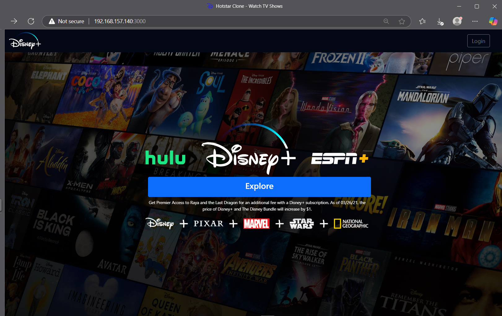
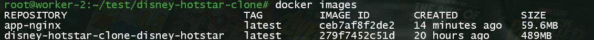

# Disney Hotstar UI Clone - Dockerized Deployment with Kubernetes & Ansible

Hotstar-Disney+ UI clone using ReactJS
---



## Tools Used

<a href="https://code.visualstudio.com/">
  
</a>
<a href="https://git-scm.com/">
  
</a>
<a href="https://github.com">
  
</a>
<a href="https://www.kernel.org">
  
</a> 
<a href="https://www.docker.com">
  
</a> 
<a href="https://nodejs.org/">
  
</a>
<a href="https://reactjs.org/">
  
</a>
<a href="https://www.npmjs.com/">
  
</a>
<a href="https://www.clipartmax.com/middle/m2H7K9i8N4Z5G6Z5_docker-compose-logo-docker/" target="_blank">
  
</a>
<a href="https://www.openssl.org/">
  
</a>


## Installation

need to install git and npm in system

```
git clone https://github.com/Gaurav1517/disney-hotstar-clone.git

cd disney-hotstar-clone

npm i

npm start

```


#  Dockerize Disney Hotstar Clone application

**Project Description**:  
This project is a simple Disney Hotstar UI clone built using React. The application has been containerized using Docker to ensure consistency across environments and simplify deployment. A multi-stage Dockerfile is utilized to optimize the image size by separating the build and production stages. The production-ready application is served using NGINX, ensuring efficient performance. Additionally, Docker Compose is used to manage and run the containerized application effortlessly.

## Prerequisites

- Docker: Make sure Docker is installed on your system. You can follow the installation guide here: [Docker Installation](https://docs.docker.com/get-docker/).
- Docker Compose: Docker Compose is required to build and manage multi-container applications. Install it from here: [Docker Compose Installation](https://docs.docker.com/compose/install/).

## Setup and Installation

1. Clone the repository:
    ```bash
    git clone https://github.com/Gaurav1517/disney-hotstar-clone.git
    cd disney-hotstar-clone
    ```

2. Build and start the application using Docker Compose:
    ```bash
    docker-compose up --build -d
    ```

    - `--build`: Rebuilds the images if any changes were made.
    - `-d`: Runs the containers in detached mode (background).

3. After the containers are up, open your browser and go to `http://localhost:3000` to view the application.

## How it Works

- **Dockerfile**: The Dockerfile builds a Node.js container that installs dependencies, builds the React application, and runs it on port 3000.
- **docker-compose.yml**: The Docker Compose file defines the services, including the Disney Hotstar React application. It also sets the environment variable `NODE_OPTIONS` to avoid OpenSSL errors when building the app.

## Docker Compose Configuration

The `docker-compose.yml` file defines a single service named `disney-hotstar`, which:

- Uses the current directory (`.`) as the build context.
- Maps port 3000 of the container to port 3000 on the host.
- Sets the environment variable `NODE_OPTIONS=--openssl-legacy-provider` to fix OpenSSL-related issues when running the app.

```yaml
version: '3.8'
services:
  disney-hotstar:
    build:
      context: .
    ports:
      - "3000:3000"
    environment:
      - NODE_OPTIONS=--openssl-legacy-provider
```

## Dockerfile Configuration

The `Dockerfile` is responsible for creating the Docker image for the React app. It:

- Uses `node:18-alpine` as the base image.
- Sets the working directory to `/app` and copies `package.json` and `package-lock.json`.
- Installs the dependencies using `npm install`.
- Copies the entire project and sets the environment variable for OpenSSL.
- Builds the application using `npm run build`.
- Exposes port 3000 and starts the application using `npm start`.

```Dockerfile
FROM node:18-alpine

# Set the working directory in the container
WORKDIR /app

# Copy package.json and package-lock.json
COPY package*.json ./

# Install dependencies
RUN npm install

# Copy the entire project
COPY . .

# Set Node.js environment variable to fix OpenSSL error
ENV NODE_OPTIONS="--openssl-legacy-provider"

# Build the application for production
RUN npm run build

# Expose the desired port
EXPOSE 3000

# Start the application
CMD ["npm", "start"]
```

## Troubleshooting

- If you encounter an error related to OpenSSL during the build process, the environment variable `NODE_OPTIONS=--openssl-legacy-provider` is already set in the Dockerfile to fix this.
- Make sure that Docker and Docker Compose are installed correctly on your system.

## Stopping and Cleaning Up

To stop the running containers and remove them, use the following command:

```bash
docker-compose down
```

## Multi-Stage Dockerfile 

### Reasons for Using a Multi-Stage Dockerfile

1. **Reduced Image Size**:  
   - Only the essential files (e.g., static assets, configuration) are included in the final image, removing build tools and development dependencies.

2. **Improved Security**:  
   - By excluding unnecessary files and dependencies, the attack surface of the final image is minimized.

3. **Optimized Build Process**:  
   - Builds are separated into distinct stages (e.g., building the app and serving it). Each stage focuses on specific tasks, leading to cleaner and more efficient builds.

4. **Reusability**:  
   - The build stage can be reused for testing or debugging without impacting the production environment.

5. **Performance**:  
   - Using NGINX in the final stage provides faster and more efficient serving of static files compared to a Node.js server.

6. **Cleaner Layer Structure**:  
   - Multi-staging ensures that each stage has its own purpose, reducing unnecessary layers in the final image.


multiStageDockerfile

### **Stage 1: Build**
```dockerfile
FROM node:18-alpine AS build

# Set the working directory in the container
WORKDIR /app

# Copy package.json and package-lock.json
COPY package*.json ./

# Install production dependencies
RUN npm ci --only=production

# Copy the rest of the application
COPY . .

# Set Node.js environment variable to fix OpenSSL error
ENV NODE_OPTIONS="--openssl-legacy-provider"

# Build the application
RUN npm run build
```
#### Explanation:
- **Base Image**: Uses the lightweight Node.js image `node:18-alpine` to reduce build size.
- **Working Directory**: `/app` is the directory where the application code resides inside the container.
- **Dependencies**: Installs only production dependencies using `npm ci --only=production` for faster, reliable builds.
- **Static Build**: Generates production-ready static files using `npm run build`.

### **Stage 2: Production**
```dockerfile
FROM nginx:alpine

# Remove default NGINX configuration
RUN rm /etc/nginx/conf.d/default.conf

# Copy custom NGINX configuration
COPY nginx.conf /etc/nginx/conf.d

# Copy the build output from the previous stage to NGINX's web root
COPY --from=build /app/build /usr/share/nginx/html

# Expose port 80
EXPOSE 80

# Start NGINX
CMD ["nginx", "-g", "daemon off;"]
```
#### Explanation:
- **Base Image**: Uses the lightweight `nginx:alpine` image, optimized for serving static files.
- **Custom Configuration**: Replaces the default NGINX configuration with `nginx.conf` for serving the React application.
- **Static Files**: Copies only the build output from the first stage, keeping the final image small.
- **Port**: Exposes port 80 for serving the application.
- **Command**: Starts the NGINX server to serve the application.

---

### How to Build and Run

#### Using Docker
1. **Build the Docker Image**:
   ```bash
   docker build -t app-nginx -f multiStageDockerfile .
   ```

2. **Run the Docker Container**:
   ```bash
   docker run -p 3000:80 app-nginx
   ```

3. Open the application in your browser at `http://localhost:3000`.

#### Using Docker Compose
1. Update the `docker-compose.yaml` file as below.

2. **Run the Application**:
   ```bash
   docker-compose up --build
   ```

---

## Updated docker-compose.yaml File

```yaml
version: '3.8'
services:
  disney-hotstar:
    build:
      context: .
      dockerfile: multiStageDockerfile
    ports:
      - "3000:80"
    environment:
      - NODE_OPTIONS=--openssl-legacy-provider
```

### Explanation:
- **`build.context`**: Specifies the directory containing the `multiStageDockerfile` and application files.
- **`build.dockerfile`**: Explicitly points to the multi-stage Dockerfile.
- **`ports`**: Maps port 80 inside the container to port 3000 on the host.
- **`environment`**: Passes the `NODE_OPTIONS` environment variable during the build stage to resolve OpenSSL issues.


This will stop and remove the containers, network, and volumes created by Docker Compose.

### Image Size Comparision


