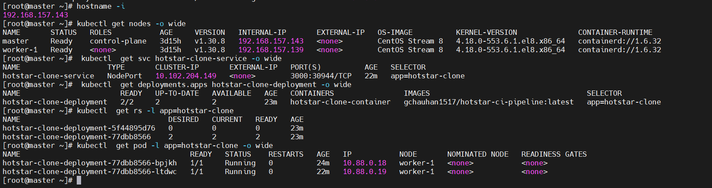

# Hotstar Clone: CI/CD with Docker & K8s

Hotstar-Disney+ UI clone using ReactJS
---


## Tools Used

<a href="https://code.visualstudio.com/">
  
</a>
<a href="https://git-scm.com/">
  
</a>
<a href="https://github.com">
  
</a>
<a href="https://www.kernel.org">
  
</a> 
<a href="https://www.docker.com">
  
</a> 
<a href="https://nodejs.org/">
  
</a>
<a href="https://reactjs.org/">
  
</a>
<a href="https://www.npmjs.com/">
  
</a>
<a href="https://www.clipartmax.com/middle/m2H7K9i8N4Z5G6Z5_docker-compose-logo-docker/" target="_blank">
  
</a>
<a href="https://www.openssl.org/">
  
</a>
<a href="https://www.jenkins.io">
  
</a>
<a href="https://github.com/tonistiigi/trivy">
  
</a>
<a href="https://nginx.org/">
  
</a>
<a href="https://www.ansible.com">
  
</a>
<a href="https://kubernetes.io">
  
</a>


## Installation

need to install git and npm in system

```
git clone https://github.com/Gaurav1517/disney-hotstar-clone.git

cd disney-hotstar-clone

npm i

npm start

```


#  Dockerize Disney Hotstar Clone application

**Project Description**:  
This project is a simple Disney Hotstar UI clone built using React. The application has been containerized using Docker to ensure consistency across environments and simplify deployment. A multi-stage Dockerfile is utilized to optimize the image size by separating the build and production stages. The production-ready application is served using NGINX, ensuring efficient performance. Additionally, Docker Compose is used to manage and run the containerized application effortlessly.

## Prerequisites

- Docker: Make sure Docker is installed on your system. You can follow the installation guide here: [Docker Installation](https://docs.docker.com/get-docker/).
- Docker Compose: Docker Compose is required to build and manage multi-container applications. Install it from here: [Docker Compose Installation](https://docs.docker.com/compose/install/).

## Setup and Installation

1. Clone the repository:
    ```bash
    git clone https://github.com/Gaurav1517/disney-hotstar-clone.git
    cd disney-hotstar-clone
    ```

2. Build and start the application using Docker Compose:
    ```bash
    docker-compose up --build -d
    ```

    - `--build`: Rebuilds the images if any changes were made.
    - `-d`: Runs the containers in detached mode (background).

3. After the containers are up, open your browser and go to `http://localhost:3000` to view the application.

## How it Works

- **Dockerfile**: The Dockerfile builds a Node.js container that installs dependencies, builds the React application, and runs it on port 3000.
- **docker-compose.yml**: The Docker Compose file defines the services, including the Disney Hotstar React application. It also sets the environment variable `NODE_OPTIONS` to avoid OpenSSL errors when building the app.

## Docker Compose Configuration

The `docker-compose.yml` file defines a single service named `disney-hotstar`, which:

- Uses the current directory (`.`) as the build context.
- Maps port 3000 of the container to port 3000 on the host.
- Sets the environment variable `NODE_OPTIONS=--openssl-legacy-provider` to fix OpenSSL-related issues when running the app.

```yaml
version: '3.8'
services:
  disney-hotstar:
    build:
      context: .
    ports:
      - "3000:3000"
    environment:
      - NODE_OPTIONS=--openssl-legacy-provider
```

## Dockerfile Configuration

The `Dockerfile` is responsible for creating the Docker image for the React app. It:

- Uses `node:18-alpine` as the base image.
- Sets the working directory to `/app` and copies `package.json` and `package-lock.json`.
- Installs the dependencies using `npm install`.
- Copies the entire project and sets the environment variable for OpenSSL.
- Builds the application using `npm run build`.
- Exposes port 3000 and starts the application using `npm start`.

```Dockerfile
FROM node:18-alpine

# Set the working directory in the container
WORKDIR /app

# Copy package.json and package-lock.json
COPY package*.json ./

# Install dependencies
RUN npm install

# Copy the entire project
COPY . .

# Set Node.js environment variable to fix OpenSSL error
ENV NODE_OPTIONS="--openssl-legacy-provider"

# Build the application for production
RUN npm run build

# Expose the desired port
EXPOSE 3000

# Start the application
CMD ["npm", "start"]
```

## Troubleshooting

- If you encounter an error related to OpenSSL during the build process, the environment variable `NODE_OPTIONS=--openssl-legacy-provider` is already set in the Dockerfile to fix this.
- Make sure that Docker and Docker Compose are installed correctly on your system.

## Stopping and Cleaning Up

To stop the running containers and remove them, use the following command:

```bash
docker-compose down
```

## Multi-Stage Dockerfile 

### Reasons for Using a Multi-Stage Dockerfile

1. **Reduced Image Size**:  
   - Only the essential files (e.g., static assets, configuration) are included in the final image, removing build tools and development dependencies.

2. **Improved Security**:  
   - By excluding unnecessary files and dependencies, the attack surface of the final image is minimized.

3. **Optimized Build Process**:  
   - Builds are separated into distinct stages (e.g., building the app and serving it). Each stage focuses on specific tasks, leading to cleaner and more efficient builds.

4. **Reusability**:  
   - The build stage can be reused for testing or debugging without impacting the production environment.

5. **Performance**:  
   - Using NGINX in the final stage provides faster and more efficient serving of static files compared to a Node.js server.

6. **Cleaner Layer Structure**:  
   - Multi-staging ensures that each stage has its own purpose, reducing unnecessary layers in the final image.


multiStageDockerfile

### **Stage 1: Build**
```dockerfile
FROM node:18-alpine AS build

# Set the working directory in the container
WORKDIR /app

# Copy package.json and package-lock.json
COPY package*.json ./

# Install production dependencies
RUN npm ci --only=production

# Copy the rest of the application
COPY . .

# Set Node.js environment variable to fix OpenSSL error
ENV NODE_OPTIONS="--openssl-legacy-provider"

# Build the application
RUN npm run build
```
#### Explanation:
- **Base Image**: Uses the lightweight Node.js image `node:18-alpine` to reduce build size.
- **Working Directory**: `/app` is the directory where the application code resides inside the container.
- **Dependencies**: Installs only production dependencies using `npm ci --only=production` for faster, reliable builds.
- **Static Build**: Generates production-ready static files using `npm run build`.

### **Stage 2: Production**
```dockerfile
FROM nginx:alpine

# Remove default NGINX configuration
RUN rm /etc/nginx/conf.d/default.conf

# Copy custom NGINX configuration
COPY nginx.conf /etc/nginx/conf.d

# Copy the build output from the previous stage to NGINX's web root
COPY --from=build /app/build /usr/share/nginx/html

# Expose port 80
EXPOSE 80

# Start NGINX
CMD ["nginx", "-g", "daemon off;"]
```
#### Explanation:
- **Base Image**: Uses the lightweight `nginx:alpine` image, optimized for serving static files.
- **Custom Configuration**: Replaces the default NGINX configuration with `nginx.conf` for serving the React application.
- **Static Files**: Copies only the build output from the first stage, keeping the final image small.
- **Port**: Exposes port 80 for serving the application.
- **Command**: Starts the NGINX server to serve the application.

---

### How to Build and Run

#### Using Docker
1. **Build the Docker Image**:
   ```bash
   docker build -t app-nginx -f multiStageDockerfile .
   ```

2. **Run the Docker Container**:
   ```bash
   docker run -p 3000:80 app-nginx
   ```

3. Open the application in your browser at `http://localhost:3000`.

#### Using Docker Compose
1. Update the `docker-compose.yaml` file as below.

2. **Run the Application**:
   ```bash
   docker-compose up --build
   ```

---

## Updated docker-compose.yaml File

```yaml
version: '3.8'
services:
  disney-hotstar:
    build:
      context: .
      dockerfile: multiStageDockerfile
    ports:
      - "3000:80"
    environment:
      - NODE_OPTIONS=--openssl-legacy-provider
```

### Explanation:
- **`build.context`**: Specifies the directory containing the `multiStageDockerfile` and application files.
- **`build.dockerfile`**: Explicitly points to the multi-stage Dockerfile.
- **`ports`**: Maps port 80 inside the container to port 3000 on the host.
- **`environment`**: Passes the `NODE_OPTIONS` environment variable during the build stage to resolve OpenSSL issues.


This will stop and remove the containers, network, and volumes created by Docker Compose.

### Image Size Comparision


### Note: Setting Up Kubernetes Environment on AWS 
#### Here's a step-by-step guide to set up Jenkins, Maven, and Docker on the **main server** and Kubernetes on a **secondary machine**:

## **Main Server Setup: Jenkins, Java, Docker, Git, Ansible, Trivy**

### **1. Install Jenkins**  
1. Update the system and install Java:  
   ```bash
   # Update and install prerequisites
    sudo yum update -y
    sudo yum install -y curl tar gzip wget vim 
    
    # JDK 17 installation
    echo "Installing Amazon Corretto JDK 17..."
    
    # Import the Corretto GPG key
    sudo rpm --import https://yum.corretto.aws/corretto.key
    
    # Add the Corretto repository
    sudo curl -L -o /etc/yum.repos.d/corretto.repo https://yum.corretto.aws/corretto.repo
    
    # Install Java 17
    sudo yum install -y java-17-amazon-corretto
    
    # Setting up JDK environment variables
    echo "Configuring Java environment variables..."
    echo "export JAVA_HOME=/usr/lib/jvm/java-17-amazon-corretto" | sudo tee -a /etc/profile
    echo "export PATH=\$PATH:\$JAVA_HOME/bin" | sudo tee -a /etc/profile
    
    # Source the profile to ensure environment variables are loaded
    source /etc/profile
    
    # Verify Java installation
    java -version
   ```
  
  2. Add the Jenkins repository and key:  
   ```bash
   echo "Installing Jenkins..."
   sudo wget -O /etc/yum.repos.d/jenkins.repo https://pkg.jenkins.io/redhat-stable/jenkins.repo
   sudo rpm --import https://pkg.jenkins.io/redhat-stable/jenkins.io.key
   ```
3. Install Jenkins:  
   ```bash
    sudo yum upgrade -y
    sudo yum install jenkins -y
    sudo systemctl enable jenkins --now
   ```
4. Access Jenkins via `http://<server-ip>:8080` and complete the setup.

---

### **2. Install Docker**
1. Install Docker:
   ```bash
    echo "Installing Docker..."
    sudo yum update -y
    sudo yum install docker -y
    sudo systemctl enable docker --now

2. Add Jenkins user to the `docker` group:
   ```bash
   sudo usermod -aG docker jenkins
   # To avoid permission denied while connecting to Docker socket
   sudo chmod 666 /var/run/docker.sock
   ```
3. Restart & verify jenkins service.
   ```bash
   sudo systemctl restart jenkins
   sudo systemctl status jenkins
   ```
    
### **4. Git Installation**
  ```bash
    sudo yum install -y git*
  ```

#4.1 If get error to install git . 
  ```bash
   sudo yum install git* -y --skip-broken
   ```

### **5. Install Trivy**
  ```bash
    echo "Installing Trivy..."
    # Add Trivy repository
    cat << EOF | sudo tee /etc/yum.repos.d/trivy.repo
    [trivy]
    name=Trivy repository
    baseurl=https://aquasecurity.github.io/trivy-repo/rpm/releases/\$basearch/
    gpgcheck=1
    enabled=1
    gpgkey=https://aquasecurity.github.io/trivy-repo/rpm/public.key
    EOF
    
    # Update the package list
    sudo yum -y update
    
    # Install Trivy
    sudo yum -y install trivy
    
    # Verify installation
    echo "Verify trivy installation."
    trivy --version
  ```

## **Install Ansible and Dependencies**

  ```bash
    echo "Installing Ansible and dependencies..."
    # Install Python 3, python-devel, python3-pip, and OpenSSL
    echo "Installing Python 3, python-devel, python3-pip, and OpenSSL..."
    sudo yum install -y python3 python3-devel python3-pip openssl
    
    # Install Ansible
    echo "Installing Ansible..."
    sudo amazon-linux-extras install ansible2 -y
    
    # Verify installations
    echo "Verifying installations..."
    python3 --version
    pip3 --version
    ansible --version
  ```


## Login to jenkins server using public ip of jenkins server through port 8080
```bash
http://<localhost:8080>
```
need to get the Administrator Password from /var/lib/jenkins/secrets/initialAdminPassword
```bash
sudo cat /var/lib/jenkins/secrets/initialAdminPassword
```


Successfully set up Jenkins server and logged in.

Next, proceed with installing plugins 
# Install plugins 
- **SSH Agent**
- **Plugin Maven** 
- **Pipeline: Stage View Plugin** 

# Configure credentials of docker hub, github, ansible-server in Jenkins Dashboard.

Dashboard > Manage Jenkins > Credentials > System > Global credentials (unrestricted) > Add credentials > New credentials > Kind: User

## Create Github token for Jenkins:
1. Go to github.com/ > User Settings > Developers Setting > Personal Access Tokens > Token (classic).
2. Generate new token > Generate new token (classic).
3. Prompt GitHub password.
4. New personal access token (classic): Note: Jenkins_project-1_token.
5. Expiration: 7 days.
6. Select scopes: Scopes define the access for personal tokens. For now, select all checkboxes.
7. Generate token and copy the token (because once the page refreshes, the token won't be visible any more).
8. Add the token to Jenkins Credentials:
   - Dashboard > Manage Jenkins > Credentials > System > Global credentials (unrestricted) > Add credentials.
   - Kind: Secret text.
   - Secret: Paste the GitHub token.
   - ID: github-token.

## Add Docker Hub credentials:
1. Dashboard > Manage Jenkins > Credentials > System > Global credentials (unrestricted) > Add credentials.
2. Kind: Username with password.
3. Username: Your Docker Hub username.
4. Password: Your Docker Hub password.
5. ID: docker-hub.

## Add Ansible server private key:

1. Create a private key using ssh-keygen:

    - Run ssh-keygen in the terminal.

    -  Save the key in the ~/.ssh directory.

2. Dashboard > Manage Jenkins > Credentials > System > Global credentials (unrestricted) > Add credentials.

3. Kind: SSH Username with private key.

4. Username: ansible.

5. Private Key: Paste the private key content from the generated file (e.g., ~/.ssh/id_rsa).

6. ID: ansible-private-key.


To copy an SSH key to a Kubernetes server for Ansible SSH authentication, you can follow these steps:

### 1. **Generate an SSH Key Pair (If You Don't Have One)**

If you haven't already generated an SSH key pair, you can do so by running:

```bash
ssh-keygen -t rsa -b 2048 -f ~/.ssh/id_rsa
```

This will generate an RSA SSH key pair with a 2048-bit key size. The private key will be saved to `~/.ssh/id_rsa` and the public key to `~/.ssh/id_rsa.pub`.

### 2. **Copy the Public SSH Key to the Kubernetes Server**

To enable Ansible to authenticate via SSH, you need to copy the public key to the Kubernetes server. Use the `ssh-copy-id` command or manually append the public key.

#### Using `ssh-copy-id`:
```bash
ssh-copy-id user@k8s-server
```
Replace `user` with the appropriate username and `k8s-server` with the IP address or hostname of your Kubernetes server.

#### Manually Adding the Public Key:
If `ssh-copy-id` is not available, you can manually copy the contents of the public key (`~/.ssh/id_rsa.pub`) and append it to the `~/.ssh/authorized_keys` file on the Kubernetes server:

1. Display the contents of the public key:
   ```bash
   cat ~/.ssh/id_rsa.pub
   ```
2. SSH into the Kubernetes server:
   ```bash
   ssh user@k8s-server
   ```
3. On the server, open or create the `~/.ssh/authorized_keys` file:
   ```bash
   mkdir -p ~/.ssh
   nano ~/.ssh/authorized_keys
   ```
4. Paste the contents of your public key into the `authorized_keys` file and save.

### 3. **Verify SSH Connection**

After copying the public key, verify that you can SSH into the Kubernetes server without needing a password:

```bash
ssh user@k8s-server
```

If you're able to log in without entering a password, SSH key authentication is set up correctly.

### 4. **Configure Ansible to Use SSH**

Ensure that your Ansible inventory is configured to use SSH for authentication. In your Ansible `inventory` file, you can specify the SSH user:

```ini
[kubernetes]
192.168.157.137
```

### 5. **Test Ansible SSH Connection**

Finally, test that Ansible can authenticate and connect to the Kubernetes server:

```bash
ansible k8s-server -m ping
```


If everything is configured correctly, you should receive a successful "pong" response from Ansible.

   ## **MAIN MACHINE CONFIGURED SUCCESSFULLY!!** 


## **Secondary Machine Setup: Kubernetes**

### **1. Install Kubernetes Tools (kubectl, kubeadm, kubelet)**

# Install Docker
  ```bash
    # REF: https://docs.aws.amazon.com/eks/latest/userguide/install-kubectl.html
    sudo yum update -y
    sudo yum install -y docker
    sudo systemctl start docker
    sudo systemctl enable docker
    sudo chmod 777 /var/run/docker.sock
  ```
    
# Install Kubernetes components
```bash
    # REF: https://kubernetes.io/docs/setup/production-environment/tools/kubeadm/install-kubeadm/
    sudo setenforce 0
    sudo sed -i 's/^SELINUX=enforcing/SELINUX=permissive/' /etc/selinux/config
```
    
 ## Add Kubernetes repository
```bash
    cat <<EOF | sudo tee /etc/yum.repos.d/kubernetes.repo
    [kubernetes]
    name=Kubernetes
    baseurl=https://pkgs.k8s.io/core:/stable:/v1.29/rpm/
    enabled=1
    gpgcheck=1
    gpgkey=https://pkgs.k8s.io/core:/stable:/v1.29/rpm/repodata/repomd.xml.key
    EOF
```

## Install kubelet, kubeadm, and kubectl
```bash
    sudo yum install -y kubelet kubeadm kubectl --disableexcludes=kubernetes
    sudo systemctl enable --now kubelet
```
    
## Initialize Kubernetes cluster
```bash
    sudo kubeadm init --pod-network-cidr=10.244.0.0/16 --ignore-preflight-errors=NumCPU,Mem
```
    
## Configure kubectl for the root user
```bash
    mkdir -p $HOME/.kube
    sudo cp /etc/kubernetes/admin.conf $HOME/.kube/config
    sudo chown $(id -u):$(id -g) $HOME/.kube/config
```
    
## Deploy Calico network plugin
```bash
    kubectl apply -f https://docs.projectcalico.org/v3.18/manifests/calico.yaml
    
    # Deploy Tigera Operator (optional)
    kubectl apply -f https://raw.githubusercontent.com/projectcalico/calico/v3.27.0/manifests/tigera-operator.yaml
 ```   
## Remove taints from control-plane nodes (allow workloads on the master node)
```bash
    kubectl taint nodes $(hostname) node-role.kubernetes.io/control-plane:NoSchedule-
  ```

### Add Worker Nodes**
1. On worker nodes, join the cluster using the command provided during `kubeadm init`:
   ```bash
   sudo kubeadm join <master-ip>:6443 --token <token> \
   --discovery-token-ca-cert-hash sha256:<hash>
   ```

###  Verify Kubernetes Cluster**
1. Check nodes:
   ```bash
   kubectl get nodes
   ```
2. Ensure all pods are running:
   ```bash
   kubectl get pods -A
   ```
 

Here’s a description of the CI pipeline in your `Jenkinsfile` for inclusion in a `README.md` file:

---

## CI Pipeline Overview

This CI pipeline automates the process of building, testing, and deploying a React-based Disney Hotstar UI Clone. It utilizes Jenkins, Docker, and Docker Hub for streamlined continuous integration. Below is a breakdown of the stages and their corresponding commands.  

---

### **Pipeline Stages**

#### **1. Cleanup Workspace**  
**Purpose:** Cleans up the workspace to remove any residual files from previous builds.  
**Command:**  
```groovy
cleanWs()
```

---

#### **2. Git Checkout**  
**Purpose:** Checks out the code from the GitHub repository.  
**Command:**  
```groovy
git branch: 'main', url: 'https://github.com/Gaurav1517/disney-hotstar-clone.git'
```

---

#### **3. Install Dependencies (React App)**  
**Purpose:** Installs required Node.js dependencies for the React application.  
**Command:**  
```sh
npm ci --only=production
```

---

#### **4. Build React App**  
**Purpose:** Builds the production-ready React app using npm.  
**Command:**  
```sh
npm run build
```

---

#### **5. Docker Image Build**  
**Purpose:** Creates a Docker image for the React application using a multi-stage Dockerfile.  
**Command:**  
```sh
docker build -t ${JOB}:${BUILD_NUMBER} -f multiStageDockerfile .
```

---

#### **6. Docker Image Tag**  
**Purpose:** Tags the Docker image for versioning and latest deployment.  
**Commands:**  
```sh
docker tag ${JOB}:${BUILD_NUMBER} ${DOCKER_USERNAME}/${JOB}:v${BUILD_NUMBER}
docker tag ${JOB}:${BUILD_NUMBER} ${DOCKER_USERNAME}/${JOB}:latest
```

---

#### **7. Docker Image Push**  
**Purpose:** Pushes the Docker images to Docker Hub for storage and deployment.  
**Commands:**  
```sh
docker login -u '${docker_user}' -p '${docker_pass}'
docker push ${DOCKER_USERNAME}/${JOB}:v${BUILD_NUMBER}
docker push ${DOCKER_USERNAME}/${JOB}:latest
```

---

#### **8. Docker Image Cleanup**  
**Purpose:** Removes unused Docker images to free up disk space.  
**Command:**  
```sh
docker image prune -af
```

---

#### **9. Post-Build Email Notification**  
**Purpose:** Sends an email notification with the build status and Docker image details.  
**Command:**  
```groovy
emailext (
    subject: "Jenkins Build Result for ${JOB} - ${buildStatus}",
    body: """<h3>Build Status: ${buildStatus}</h3>
            <p>Docker image ${DOCKER_USERNAME}/${JOB}:${BUILD_NUMBER} has been built and pushed successfully.</p>""",
    to: "${EMAIL_RECIPIENT}"
)
```

---

### **Key Features**  
- **Automation:** End-to-end automation from code checkout to deployment.  
- **Scalability:** Built images are tagged for versioning and pushed to Docker Hub.  
- **Notifications:** Email notifications ensure immediate awareness of build status.  

This CI pipeline ensures seamless integration and deployment of your React-based Disney Hotstar UI Clone.


## Registry docker image 


## CD Pipeline Overview

Here’s an explanation of the Continuous Deployment (CD) pipeline with commands for your `README.md` file:

---

### **CD Pipeline Overview**  
This CD pipeline automates the deployment of the Disney Hotstar UI Clone application on a Kubernetes cluster. It leverages Jenkins, Ansible, and Kubernetes to pull files, approve changes, and deploy the application.  

---

### **Pipeline Stages**

#### **1. Pull Files**  
**Purpose:** Pulls the necessary files from the repository onto the target server using an Ansible playbook.  
**Command:**  
```sh
ansible-playbook -i /etc/ansible/hosts -u ${EC2_NAME} -e pipeline_name=${PIPELINE_NAME} /var/lib/jenkins/workspace/Disney-Hotstar-UI-Clone-CI-CD-Pipeline/pull-files.yml
```

---

#### **2. Approval**  
**Purpose:** Pauses the pipeline for manual approval before proceeding with the deployment.  
**Command:**  
```groovy
input message: 'Approve deployment?'
```

---

#### **3. Deployment**  
**Purpose:** Deploys the application to the Kubernetes cluster using the following steps.  

1. **Apply Kubernetes Deployment & Service Manifest:**  
   Deploys or updates the Kubernetes deployment & service configuration.  
   **Command:**  
   ```sh
   ssh -o StrictHostKeyChecking=no ${EC2_NAME}@${NODE_IP} kubectl apply -f /root/k8s-manifest/k8s-deployment-service.yaml"
   ```
   
3. **Rollout Restart:**  
   Restarts the Kubernetes deployment to apply the changes.  
   **Command:**  
   ```sh
   ssh -o StrictHostKeyChecking=no ${EC2_NAME}@${NODE_IP} kubectl rollout restart deploy disney-hotstar-ui-clone
   ```

5. **Verify Kubernetes Services:**  
   Displays the Kubernetes services to confirm successful deployment.  
   **Command:**  
   ```sh
   ssh -o StrictHostKeyChecking=no ${EC2_NAME}@${NODE_IP} kubectl get service
   ```

---

### **Key Features**  
- **Automated Pulling:** Retrieves the latest application files using Ansible.  
- **Manual Control:** Includes an approval step to validate deployments.  
- **Kubernetes Deployment:** Deploys the app as a Kubernetes service for scalability and fault tolerance.  
- **Versioning:** Uses the latest Docker image for deployment.  
- **Verification:** Lists active services to confirm successful deployment.

This CD pipeline ensures reliable and efficient deployment to your Kubernetes cluster.




## **Get acces application with kubernetes server ip and service port.**
http://<<k8s-server:service-port>>


